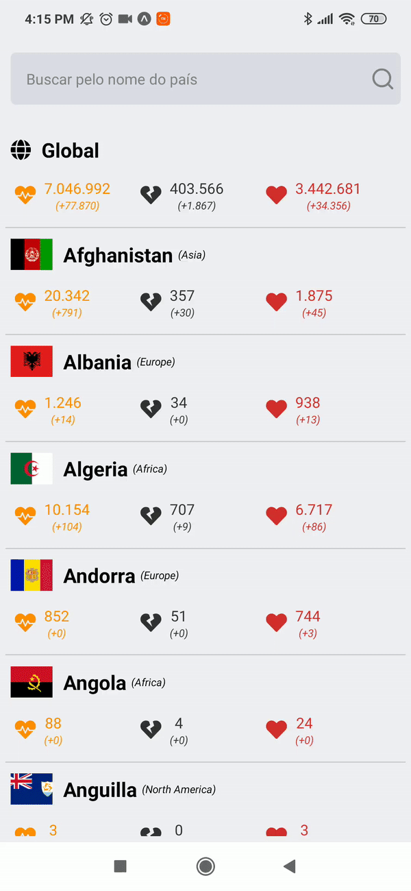

<h3 align="center">
    
    <br><br>
    <b>Covid19 Tracker! #FiqueEmCasa 😷</b> 
</h3>

<p align="center">
  <a href="https://www.linkedin.com/in/glaycon-gomes-05a7a5a7/">
    
  </a>
</p>

# Indice

- [Sobre](#-sobre)
- [Screenshots](#-sobre)
- [Mas por que devemos nos cuidar?](#-Mas-por-que-devemos-nos-cuidar?)
- [Tecnologias Utilizadas](#-tecnologias-utilizadas)
- [Como baixar o projeto](#-como-baixar-o-projeto)
- [Próximos passos](#-Todo)

## 🔖 Sobre

O <strong>Covid19 Tracker</strong> é uma aplicação Mobile para ajudar pessoas a acompanharem os casos de Covid 19 pelo mundo.

## 📷 Screenshots

<h1>
    
</h1>

## 🤔 Mas por que devemos nos cuidar?

Estamos vivenciando uma das maiores crises humanitárias devido a esse vírus. Não é segredo do tão letal que esse vírus pode ser! Temos acompanhado nos noticiários a quantidade de vítimas que essa doença já fez. Por isso devemos nos cuidar e tentar diminuir o número de casos que ainda cresce a cada dia.

## 🚀 Tecnologias utilizadas

Este projeto foi desenvolvido com as seguintes tecnologias:

- [React Native](https://reactnative.dev/)
- [Expo](https://expo.io/)
- [Covid Rest API](https://corona.lmao.ninja/)

<a id="como-usar"></a>

## 🔥 Como baixar o projeto

- ### **Pré-requisitos**

  - É **necessário** possuir o **[Node.js](https://nodejs.org/en/)** instalado na máquina
  - Também, é **preciso** ter um gerenciador de pacotes seja o **[NPM](https://www.npmjs.com/)** ou **[Yarn](https://yarnpkg.com/)**.
  - Por fim, é **essencial** ter o **[Expo](https://expo.io/)** instalado de forma global na máquina
  - **Extra**: utilizar o app do Expo para testar diretamente no smartphone. [Android App](https://play.google.com/store/apps/details?id=host.exp.exponent&referrer=www) ou [IOS App](https://itunes.apple.com/app/apple-store/id982107779).

1. Faça um clone :

```sh
  # Clonar o repositório
  $ git clone https://github.com/.../covid19Tracker.git

  # Entrar no diretório
  $ cd covid19Tracker
```

2. Executando a Aplicação:

```sh
  # Instale as dependências
  $ npm install

  # Inicie a aplicação web
  $ npm start
```

## :memo: License

Esse projeto está sob a licença MIT. Veja o arquivo [LICENSE](LICENSE.md) para mais detalhes.

## Agradecimentos

Esse `README` foi inspirada no README da **[Daniele Leão](https://github.com/danileao/rocketmusic)**, vai lá para dar uma conferida no projeto! 🤘

Semana Omnistack e Next Level Week da **[Rocketseat](https://github.com/Rocketseat)** deram aquela ajuda na hora de desenvolver! :rocket:

## Todo

- [ ] Performar o carrecamento da lista de paises;
- [ ] Versão dark;


---

<h4 align="center">
    Feito com ❤️ by <a href="https://www.linkedin.com/in/glaycon-gomes-05a7a5a7/" target="_blank">Glaycon Gomes</a>
</h4>